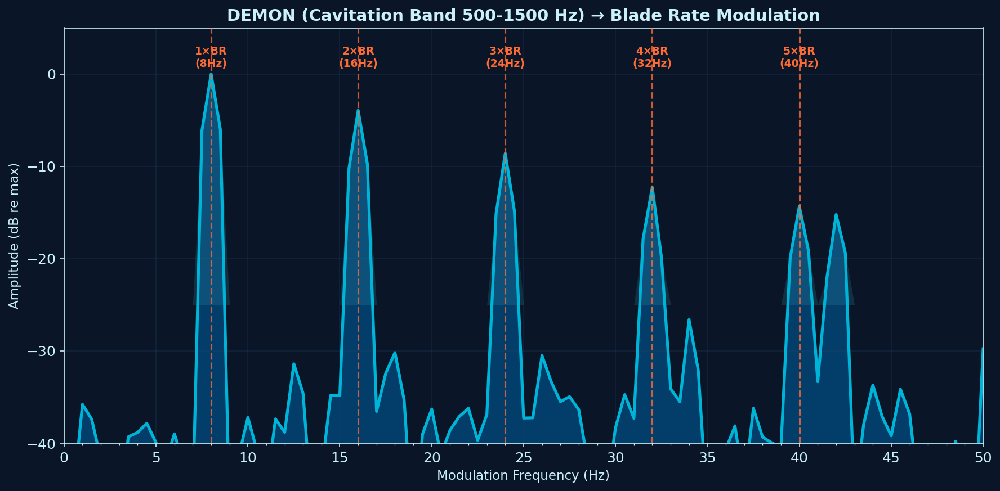
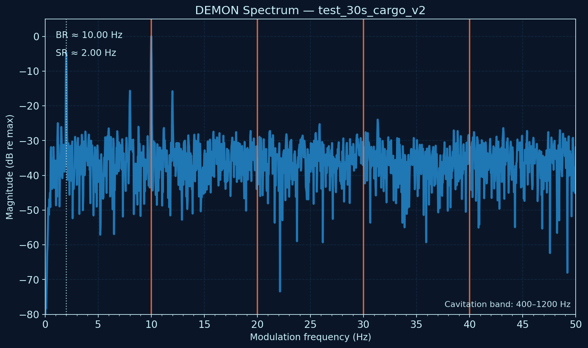

# DEMON-Analysis

**DEMON** (Detection of Envelope Modulation on Noise) for underwater acoustics — recovering a
vessel's **shaft rate (SR)** and **blade rate (BR)** from its own radiated noise.



*The canonical case: a cavitating four-bladed vessel, cavitation band 500–1500 Hz. The comb at
8 Hz and its integer multiples is the blade rate; SR = BR / 4 = 2 Hz, i.e. a shaft turning at
120 RPM. Amplitude is normalised to the in-band peak (0 dB re max). Smoothed for legibility —
raw output from the CLI is unsmoothed and noisier, as in the example below.*

Maintained by [Oravont Systems LLP](https://oravontsystems.com) as the signal-processing
companion to **SKANN-SSL**. DEMON is deliberately decoupled from the machine-learning stack: it
is transparent physics, which makes it useful for validating synthetic data, explaining what a
learned model has separated, and producing features a review board can read.

## Background

The method, the reasoning behind the band-selection step, and a case study in which DEMON caught
a defect that spectrograms had hidden are written up here:

**[DEMON Analysis: Reading a Vessel's Propulsion from Its Own Noise](docs/DEMON_Analysis_Report.pdf)** — Oravont Systems working note.

## What DEMON does

A cavitating propeller is a broadband noise source, but the cavitation is not steady: each blade
loads and unloads as it sweeps through the wake, so the broadband noise is amplitude-modulated at
the blade-passage rhythm. The cavitation is the *carrier*; the propeller kinematics are the
*modulation*. DEMON demodulates the carrier and reads the rhythm.

1. **Bandpass** the recording in a cavitation-dominated band (isolates the carrier)
2. **Hilbert envelope** — take the analytic signal and extract its magnitude
3. **AC-couple** the envelope — remove DC and slow drift
4. **FFT of the envelope** → low-frequency modulation spectrum, typically 0–50 Hz

The key point: this is the spectrum *of the envelope*, not of the signal. The information lives in
how the loudness fluctuates, not in the frequencies of the noise itself.

Two relationships turn the result into engineering numbers:

- **SR (Hz)** = RPM / 60
- **BR (Hz)** = SR × *N* blades

## Quick start

### 1. Install

```bash
pip install -r requirements.txt
```

### 2. Run the included samples

Two sample clips ship with the repository; ground truth is in
`examples/test_30s_v2_metadata.csv`.

| clip | class | SR | blades | BR | cavitation peak |
|---|---|---|---|---|---|
| `test_30s_cargo_v2.npy` | cargo ship | 2.0 Hz | 5 | 10.0 Hz | 800 Hz |
| `test_30s_fishing_v2.npy` | fishing vessel | 5.5 Hz | 4 | 22.0 Hz | 1800 Hz |

**Cargo** — cavitation sits near 800 Hz, so band the carrier around it:

```bash
python src/demon_cli.py examples/test_30s_cargo_v2.npy \
    --bandpass 400 1200 --br 10.0 --blades 5 --harmonics 4 \
    --output outputs/cargo_demon.png
```



*Actual CLI output for the command above. BR is recovered at 10.00 Hz and SR at 2.00 Hz, matching
the manifest exactly. Note that 2× and 3× BR sit close to the noise floor here — the fundamental
and the shaft-rate line carry the detection. Real spectra rarely look as tidy as the figure at the
top of this page.*

**Fishing vessel** — cavitation sits near 1800 Hz, so the band moves up:

```bash
python src/demon_cli.py examples/test_30s_fishing_v2.npy \
    --bandpass 1400 2200 --br 22.0 --blades 4 --harmonics 4 \
    --output outputs/fishing_demon.png
```

### 3. Without prior knowledge of BR

Drop `--br` and `--blades` and read the comb off the plot:

```bash
python src/demon_cli.py examples/test_30s_cargo_v2.npy --bandpass 400 1200
```

`outputs/` is git-ignored — generated plots stay local.

### Choosing the band

The bandpass is not a detail; it is the decision that determines whether the result means
anything. Cavitation energy concentrates in different regions for different vessel types — a
slow-turning tanker cavitates far lower in frequency than a fast small craft. **Bandpass in a
region the vessel doesn't cavitate in, and you demodulate ambient noise.** Starting points:

| class | cavitation band | typical BR |
|---|---|---|
| Tanker | 300–1000 Hz | 3–8 Hz |
| Cargo ship | 400–1200 Hz | 4–12 Hz |
| Fishing vessel | 1400–2200 Hz | 15–30 Hz |
| Small craft | 1500–3000 Hz | 20–50 Hz+ |

The conventional 0–50 Hz DEMON display is built around merchant-vessel assumptions. A fast small
craft with several blades can put its blade rate well above 100 Hz — entirely off that plot. Raise
`--max-mod` when working with fast craft; the comb is often present when the window is not.

## Reading the output

A good DEMON spectrum of a cavitating vessel shows a **harmonic comb**: a line at the shaft rate,
a stronger family at the blade rate and its integer multiples.

- Identify the fundamental of the dominant comb → candidate BR
- Look for a weaker line at BR/*N* for small integer *N* → candidate SR, and *N* is the blade count
- Check that 2×, 3×, 4× BR line up — a comb that doesn't repeat at integer multiples is telling
  you something else is modulating the band

The tallest single line is not necessarily the blade rate; it is frequently a shaft-rate harmonic.
Individual peak heights vary with propagation and band choice. **The spacing of the comb is the
robust observable, not the height of any one peak.**

## Repository layout

```
src/demon_core.py               DEMON computation + BR/SR detection (signal processing)
src/demon_plotting.py           single source of truth for plot styling
src/demon_cli.py                CLI entry point — generates plots from .npy clips
src/demon_visualizer_pso.py     blind band search via particle-swarm optimisation
src/demon_batch_validator_v5.py batch validation against a ground-truth manifest
src/ship_noise_corrected.py     synthetic ship-noise generator (physics-based cavitation model)

examples/                       two sample .npy clips + ground-truth metadata CSV
assets/                         figures used in this README
docs/                           working note (PDF), project notes, method notes
```

## Documentation

- [DEMON Analysis — working note (PDF)](docs/DEMON_Analysis_Report.pdf)
- [Project notes](docs/DEMON_ANALYSIS_PROJECT_NOTES.md)
- [Swell modulation artefact fix](docs/SWELL_MODULATION_FIX.md)
- [Validation methodology and status](docs/VALIDATION_NOTES.md)

## Synthetic data

`src/ship_noise_corrected.py` generates physics-grounded synthetic ship noise: tonal harmonics,
broadband structure, hull resonances, Knudsen sea-state noise, and a cavitation model built from
Rayleigh bubble-collapse timing with collapse, cloud and sheet burst regimes distributed across
each blade passage.

It is published so that results from the dataset it produces can be reproduced and checked. It is
a *generator*, not a classifier — synthetic clips are for pretraining and for validating that a
processing chain recovers what was put in.

## Licence

Dual-licensed, because code and prose are different things:

- **Code** (`src/`, everything `.py`) — [MIT](LICENSE)
- **Documentation, figures and sample data** (`docs/`, `assets/`, `examples/`) —
  [CC BY 4.0](LICENSE-DOCS)

Attribution for the documents: *Oravont Systems LLP — oravontsystems.com*.

## Citation

```bibtex
@techreport{tyagi2026demon,
  author      = {Tyagi, Sunil},
  title       = {DEMON Analysis: Reading a Vessel's Propulsion from Its Own Noise},
  institution = {Oravont Systems LLP},
  year        = {2026},
  type        = {Working Note},
  url         = {https://github.com/Oravont/DEMON-Analysis}
}
```
